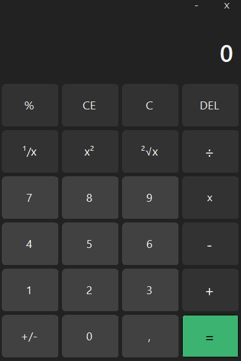
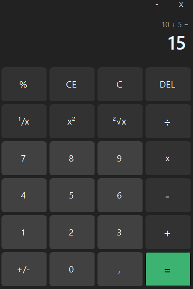

# 🧮 Calculadora WinForms

Aplicação de calculadora desenvolvida em **C# com Windows Forms**.

## Interface

### Estado inicial  
Interface padrão, antes de realizar qualquer operação:

  

---

### Após realizar uma operação  
Os valores e a operação executada são exibidos na parte superior da interface:

  

